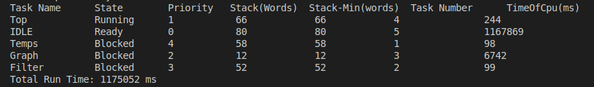
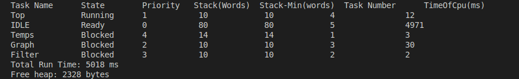

## Consigna
Utilizando el emulador QEMU para emular un sistema Stellaris LM3S811, se debio desarrollar una aplicacion utilizando FreeRTOS con las siguientes caracteristicas:

-   Una tarea que simule un sensor de temperatura, generando valores aleatorios a 10Hz.
-   Una tarea que reciba estos valores y les aplique un filtro pasabajos en el cual cada valor resultante de este es el promedio de las ultimas N mediciones.
    -   Este valor N, se debe poder modificar mediante la interfaz UART.
    -   Los valores resultantes del filtro se deben graficar en el display 16x96 del dispositivo.
-   Una tarea que implemente un sistema tipo top de Linux, mostrando de forma periodica estadisticas de las tareas.
-   Calcular el stack necesario para cada task utilizando uxTaskGetStackHighWaterMark o vApplicationStackOverflowHook.

## Implementaciones
### Sensor de temperatura:
Esta tarea se implementó utilizando un generador de numeros aleatorios muy sencillo, luego se tratan estos valores para que se mantengan entre 0 y 99 grados.
Esta tarea envia a la cola de valores de temperatura el valor obtenido.
Mediante la utilizacion de vTaskDelayUntil, nos aseguramos una frecuencia de 10Hz regular.

```c
static void vTemperatureSensorTask(void *pvParameters)
{
    const TickType_t xFrequency = pdMS_TO_TICKS(100); // 10Hz frequency
    TickType_t xLastWakeTime = xTaskGetTickCount();

    for(;;)
    {
        int temperature = simple_rand() % 100;  // Simulate temperature between 0 and 99 degrees
        xQueueSend(xTemperatureQueue, &temperature, portMAX_DELAY);
        vTaskDelayUntil(&xLastWakeTime, xFrequency);
    }
}
```

### Filtro pasabajos:
Este filtro recibe por la cola de temperatura los valores a filtrar, calculando el promedio de los ultimos N valores recibidos y enviandolos a la cola de filtrados. 
El valor de N comienza en 3, pero puede variar segun lo recibido en la cola de N, este valor es recibido por UART, lo cual se detallara mas adelante.
Los valores son cargados en un buffer circular, cuando la cantidad de valores en el buffer es menor a N, el promedio se calcula con los valores disponibles. 

```c
static void vFilterTask(void *pvParameters)
{
    int N = 3; // Initial value of N
    int buffer[MAX_N] = {0}; // Static buffer of fixed size
    int sum = 0;
    int receivedN = 3;
    int temperature = 0;
    int count = 0; // Variable that allows calculating the average even when the number of samples is less than N.

    for (;;)
    {
        /* Check if a new value for N has been received */
        if (xQueueReceive(xNQueue, &receivedN, 0) == pdPASS)
        {
            /* Adjust the value of N */
            N = receivedN;
        }

        if (xQueueReceive(xTemperatureQueue, &temperature, portMAX_DELAY) == pdPASS)
        {
            for (int i = MAX_N - 1; i > 0; i--)
            {
                buffer[i] = buffer[i - 1];
            }
            buffer[0] = temperature;
            if (count < MAX_N) count++;
            sum = 0; // Reset sum before adding the values from the buffer
            int valuesToAverage = (count < N) ? count : N;
            for (int i = 0; i < valuesToAverage; i++)
            {
                sum += buffer[i];
            }
            int filteredValue = sum / valuesToAverage;
            xQueueSend(xFilteredQueue, &filteredValue, portMAX_DELAY);
        }
    }
}
```

#### Recepcion de N por UART:
Mediante la utilizacion de interrupciones, se recibe por UART el valor deseado para N, este valor puede ir del 1 al 9, cualquier otro valor no sera tenido en cuenta y hara un echo con una E indicando el error.
El nuevo valor de N sera enviado a la cola de N.

``` c
void vUART_ISR(void)
{
    uint32_t ulStatus;
    char c;
    int newN;

    /* Get the interrupt status. */
    ulStatus = UARTIntStatus(UART0_BASE, true);

    /* Clear the asserted interrupts. */
    UARTIntClear(UART0_BASE, ulStatus);

    /* Check if it's a receive interrupt. */
    if (ulStatus & (UART_INT_RX | UART_INT_RT))
    {
        /* Get the character from UART. */
        c = UARTCharGet(UART0_BASE);

        /* Check if the character is a valid number between '1' and '9'. */
        if (c >= '1' && c <= '9')
        {
            newN = c - '0'; // Convert ASCII to integer

            /* Send the new value of N to the filter task via the queue. */
            xQueueSendFromISR(xNQueue, &newN, NULL);

            UARTCharPut(UART0_BASE, c);

            /* Exit the ISR to free the UART. */
            return;
        }
        else
        {
            UARTCharPut(UART0_BASE, 'E'); // Echo 'E' for error
        }
    }
}
```

#### Grafico de los valores filtrados:
La tarea recibe desde la cola de filtrados los valores a graficar, luego, los escala entre 0 a 16 para que puedan entrar en la pantalla.
El graficador contiene un buffer con los valores del grafico, este buffer es utilizado en la funcion OSRAMImageDraw() para cargar en la pantalla los pixeles a dibujar.
Este buffer es manipulado por la funcion intToGraph(), la cual recibe como parametros el buffer y el nuevo valor recibido, luego desplaza los valores del buffer a la derecha para simular movimiento del grafico y carga en la primer columna el nuevo valor recibido.
Este buffer es de tamaño 96*2, ya que los primeros 96 valores corresponden a la parte superior de la pantalla (Cada bit del uchar es un pixel de cada columna) y los siguientes 96 valores corresponden a la parte inferior de esta.

``` c
static void vGraphTask(void *pvParameters)
{
    int filteredValue;
    unsigned char graph[2 * MAX_WIDTH] = {0}; // Buffer to store the graph on the two lines of the screen

    // Initialize the LCD screen
    OSRAMInit(false);
    OSRAMClear();

    for (;;)
    {
        /* Wait for a filtered value to arrive. */
        xQueueReceive(xFilteredQueue, &filteredValue, portMAX_DELAY);
    
        /* Scale the filtered value to the height of the graph. */
        int scaledValue = (filteredValue * (MAX_HEIGHT)) / 99;        
        /* Call the intToGraph function to update the graph buffer. */
        intToGraph(graph, scaledValue);
        /* Clear the LCD screen before drawing the graph */
        OSRAMClear();
        /* Draw the graph on the LCD screen. */
        OSRAMImageDraw(graph, 0, 0, MAX_WIDTH, 2);
    }
}

void intToGraph(unsigned char graph[2*MAX_WIDTH], int value)
{
    // Shift the graph buffer to the right to make space for the new value
    for(int i = MAX_WIDTH - 1; i > 0; i--)
    {
        graph[i] = graph[i - 1]; // Shift the upper part of the graph
        graph[i + MAX_WIDTH] = graph[i + MAX_WIDTH - 1]; // Shift the lower part of the graph
    }

    // Clear the first column of the graph
    graph[MAX_WIDTH] = 0; // Clear the upper part
    graph[0] = 0; // Clear the lower part

    // Update the graph with the new value
    if(value < 8)
    {
        // If the value is less than 8, update the upper part of the graph
        graph[MAX_WIDTH] = (1 << (7 - value));
    }
    else
    {
        // If the value is 8 or greater, update the lower part of the graph
        graph[0] = (1 << (15 - value));
    }
}
```

### Funcion tipo TOP
Esta funcion obtiene de forma periodica las estadisticas de las tareas utilizando la funcion uxTaskGetSystemState() y luego las envia por UART formateadas para la lectura del usuario.
La informacion dada para cada tarea es:
- Nombre de la tarea
- Estado de la tarea
- Prioridad
- Palabras libres del stack
- Minimo historico de palabras libres en el stack (Debe activarse poniendo WATERMARK_MIN en 1 en header.h)
- Numero de tarea
- Tiempo total de cpu de la tarea

La informacion general del sistema dada es:
- Tiempo total de ejecucion del sistema
- Espacio libre en el heap


``` c
static void vTopTask(void *pvParameters)
{
    char buffer[128];
    char temp[32];
    UBaseType_t uxArraySize, x;
    TaskStatus_t pxTaskStatusArray[configMAX_PRIORITIES]; 
    uint32_t ulTotalRunTime;
    size_t xFreeHeapSize;
    TickType_t xLastWakeTime;

    #if WATERMARK_MIN == 1
    TaskHistory_t xTaskHistoryArray[configMAX_PRIORITIES];
    #endif

    uxArraySize = uxTaskGetNumberOfTasks();
    xLastWakeTime = xTaskGetTickCount();

    for (;;)
    {
        // Initialize the task history array if WATERMARK_MIN is defined as 1
        #if WATERMARK_MIN == 1
        for (x = 0; x < configMAX_PRIORITIES; x++) {
            xTaskHistoryArray[x].xTaskHandle = NULL;
            xTaskHistoryArray[x].usLowestStack = 0xFFFF; // Initial high value
        }
        #endif

        // Get the state of all tasks
        uxArraySize = uxTaskGetSystemState(pxTaskStatusArray, uxArraySize, &ulTotalRunTime);

        // Send header via UART depending on the value of WATERMARK_MIN
        #if WATERMARK_MIN == 1
        UARTSendString("Task Name      State        Priority   Stack(Words)  Stack-Min(words)  Task Number      TimeOfCpu(ms)\r\n");
        #else
        UARTSendString("Task Name      State        Priority   Stack(Words)  Task Number  TimeOfCpu(ms)\r\n");
        #endif

        // Iterate through all tasks and send their statistics via UART
        for (x = 0; x < uxArraySize; x++)
        {
            // Format the task name
            padString(buffer, pxTaskStatusArray[x].pcTaskName, 15);

            // Format the task state
            padString(buffer + 15, getTaskStateString(pxTaskStatusArray[x].eCurrentState), 13);

            // Format the task priority
            my_itoa(pxTaskStatusArray[x].uxCurrentPriority, temp);
            padString(buffer + 28, temp, 12);

            // Format the task stack
            my_itoa(pxTaskStatusArray[x].usStackHighWaterMark, temp);
            padString(buffer + 40, temp, 14);

            // Update and format the lowest historical stack value if WATERMARK_MIN is defined as 1
            #if WATERMARK_MIN == 1
            for (int i = 0; i < configMAX_PRIORITIES; i++) {
                if (xTaskHistoryArray[i].xTaskHandle == pxTaskStatusArray[x].xHandle || xTaskHistoryArray[i].xTaskHandle == NULL) {
                    if (xTaskHistoryArray[i].xTaskHandle == NULL) {
                        xTaskHistoryArray[i].xTaskHandle = pxTaskStatusArray[x].xHandle;
                    }
                    if (pxTaskStatusArray[x].usStackHighWaterMark < xTaskHistoryArray[i].usLowestStack) {
                        xTaskHistoryArray[i].usLowestStack = pxTaskStatusArray[x].usStackHighWaterMark;
                    }
                    my_itoa(xTaskHistoryArray[i].usLowestStack, temp);
                    padString(buffer + 54, temp, 14);
                    break;
                }
            }
            #endif

            // Format the task number
            #if WATERMARK_MIN == 1
            my_itoa(pxTaskStatusArray[x].xTaskNumber, temp);
            padString(buffer + 68, temp, 16);
            #else
            my_itoa(pxTaskStatusArray[x].xTaskNumber, temp);
            padString(buffer + 54, temp, 12);
            #endif

            // Format the task CPU time
            #if WATERMARK_MIN == 1
            my_itoa(pxTaskStatusArray[x].ulRunTimeCounter, temp);
            padString(buffer + 84, temp, 17);
            #else
            my_itoa(pxTaskStatusArray[x].ulRunTimeCounter, temp);
            padString(buffer + 66, temp, 15);
            #endif

            // End the string with "\r\n"
            #if WATERMARK_MIN == 1
            buffer[101] = '\r';
            buffer[102] = '\n';
            buffer[103] = '\0';
            #else
            buffer[81] = '\r';
            buffer[82] = '\n';
            buffer[83] = '\0';
            #endif

            // Send the formatted line via UART
            UARTSendString(buffer);
        }

        // Send the total run time
        UARTSendString("Total Run Time: ");
        my_itoa(ulTotalRunTime, temp);
        UARTSendString(temp);
        UARTSendString(" ms\r\n");

        // Get and send the free heap size
        xFreeHeapSize = xPortGetFreeHeapSize();
        UARTSendString("Free heap: ");
        my_itoa(xFreeHeapSize, temp);
        UARTSendString(temp);
        UARTSendString(" bytes\r\n");

        // Wait before the next update
        vTaskDelayUntil(&xLastWakeTime, mainTOP_TASK_DELAY);
    }
}
```

### Calculo de stack:
Para la definicion del tamaño del stack de las tareas se ejecuto el sistema con la flag de WATERMARK_MIN en 1 (Esta aumenta el uso del stack, por lo que el tamaño que se define para la tarea del top es considerando que la misma este activa) durante aproximadamente 1175 segundos, asignandole 100 palabras a las tareas Temps, Graph y Filter y 200 palabras a la tarea Top.
Luego de los 1175 segundos se definio en base al valor minimo registrado en el stack, cual iba a ser el tamaño de cada uno de estos, dejando un margen de 10 palabras para cada tarea por precaucion.

Resultados:





## Referencias

https://www.freertos.org/


